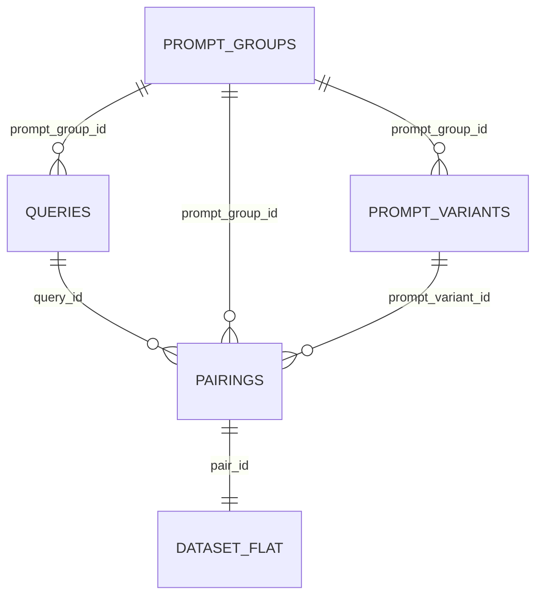

# P2W-Bench-ZHEN 数据字段说明

本文档是 P2W-Bench-ZHEN 的数据字典，说明配置文件、中间文件、最终 JSONL、validator 和 manifest 中每个字段的含义。

## 1. 基本约定

- JSONL 文件使用 UTF-8 编码，每一行是一个完整 JSON 对象。
- `prompt` 和 `query` 始终分开保存。实验时才按 `{prompt}\n{query}` 拼接。
- 数据集中不保存 `full_input` 或 `full_prompt_output`。
- 所有 `*_tokens` 字段均为近似 token 数，除非字段名称明确写出具体 tokenizer。
- `zh` 表示中文，可能同时包含简体中文和保留原貌的繁体中文 DRCD 样本。
- `en` 表示英文。

## 2. 文件关系



当前 v0.2 中，一个 prompt group 表示一条可复用指令，可以拥有多个 query；每个 prompt group 对应三个长度 variant；每个 variant 与该组全部 query 分别形成 pairing。知识任务固定为一条指令对应一个 query，描述性任务默认一条指令对应三个 query。

## 3. 通用枚举

### `language`

| 值 | 含义 |
|---|---|
| `zh` | 中文样本，包括简体及部分原始繁体数据 |
| `en` | 英文样本 |

### `task_family`

| 值 | 含义 | 主要评估目标 |
|---|---|---|
| `knowledge` | 上下文包含回答查询所需知识 | 独立标准答案准确率及 full-prompt 一致性 |
| `descriptive` | 解释、分析、建议、总结、创作等开放任务 | 与 full-prompt 输出的一致性 |
| `style` | 规定语气、角色或表达风格 | 风格保持及 full-prompt 一致性 |
| `format` | JSON、XML、表格等结构要求 | 程序化格式验证及内容一致性 |
| `output_control` | 固定前后缀、I2W 标记、两条回复 | 程序化规则验证及内容一致性 |

### `length_variant`

| 值 | 默认近似 token 范围 | 含义 |
|---|---:|---|
| `short` | 30-95 | 短 prompt；知识类允许保留完整的局部证据窗口 |
| `medium_redundant` | 90-150 | 中等长度同义冗余 prompt |
| `long_redundant` | 180-280 | 较长同义冗余 prompt |

### `expansion_type`

| 值 | 含义 |
|---|---|
| `redundant` | 通过重复相同事实或同义重述扩大长度，不加入 distractor 或新条件 |

## 4. Query 文件

文件：

- `data/final/queries_zh.jsonl`
- `data/final/queries_en.jsonl`

每行表示一个核心 query。

| 字段 | 类型 | 必需 | 含义 |
|---|---|---:|---|
| `query_id` | string | 是 | 本次构建中的 query 主键，例如 `zh-descriptive-001--q002` |
| `prompt_group_id` | string | 是 | 所属指令组外键；同组 query 共享同一条指令及其长度变体 |
| `query_index_within_group` | integer | 是 | Query 在所属指令组内从 1 开始的稳定序号 |
| `language` | string | 是 | 语言枚举：`zh` 或 `en` |
| `task_family` | string | 是 | 任务族枚举 |
| `query` | string | 是 | 实际查询文本；运行时放在 prompt 之后 |
| `query_approx_tokens` | integer | 是 | 由项目内正则 tokenizer 估算的 query token 数 |
| `source` | string | 是 | 来源简称，例如 `squad`、`dolly`、`cmrc2018`、`drcd`、`belle_seed`、`synthetic` |
| `source_id` | string | 是 | 上游 question/task ID；Dolly 使用构建时的固定行号 ID；合成样本使用人工稳定 ID |
| `source_category` | string 或 null | 是 | 上游任务类别、BELLE task name 或合成子类型；上游没有类别时可为 null |
| `is_public_query` | boolean | 是 | `true` 表示 query 来自公共数据；`false` 表示本项目构造 |
| `gold_answers` | array[string] | 是 | 可接受标准答案及别名；开放任务为空数组 `[]` |

注意：

- `gold_answers=[]` 不表示样本无效，而表示它不使用独立唯一答案，后续主要与 full-prompt 输出比较。
- `query_id` 当前包含顺序编号。扩大来源配额后，部分编号可能变化；跨版本追溯优先使用 `source + source_id`。
- `query_approx_tokens` 不是 Qwen tokenizer 的精确值，只用于构建时分桶和质量检查。

示例：

```json
{
  "query_id": "zh-knowledge-001",
  "prompt_group_id": "zh-knowledge-001",
  "query_index_within_group": 1,
  "language": "zh",
  "task_family": "knowledge",
  "query": "基氏软汉鱼分布在哪个地区？",
  "query_approx_tokens": 15,
  "source": "cmrc2018",
  "source_id": "...",
  "source_category": null,
  "is_public_query": true,
  "gold_answers": ["马达加斯加东岸"]
}
```

## 5. Prompt Group 文件

文件：`data/final/prompt_groups.jsonl`

Prompt group 表示一个语义不变的 prompt 核心，长度 variant 都从它生成。

| 字段 | 类型 | 必需 | 含义 |
|---|---|---:|---|
| `prompt_group_id` | string | 是 | Prompt group 主键，表示一条可复用指令 |
| `language` | string | 是 | Prompt 使用的语言 |
| `task_family` | string | 是 | 任务族 |
| `subtype` | string | 是 | 更细粒度的 prompt 类型 |
| `core_prompt` | string | 是 | 最短语义核心；长度扩展的基础文本 |
| `restatement` | string | 是 | 用于生成 medium/long 版本的同义重述材料 |
| `core_facts` | array[string] | 是 | 必须在所有长度版本中保持不变的知识；非知识任务通常为空数组 |
| `core_constraint` | string 或 null | 是 | 必须保持不变的约束；知识任务通常为 `answer_from_reference_only` |
| `semantic_signature` | string | 是 | 根据核心事实和约束计算的 16 位 SHA-256 截断指纹 |
| `validator` | object | 是 | 本组输出应使用的 validator 规范 |

### `subtype` 常见取值

知识类：

- `public_extractive`
- `fictional_multihop`
- `counterfactual`

风格类：

- `academic`
- `beginner_friendly`
- `professional_advisor`
- `patient_teacher`
- `concise_direct`
- `storyteller`

格式类：

- `json_answer`
- `xml_answer`
- `numbered_list`
- `markdown_table`
- `key_value`
- `pipe_line`

输出控制类：

- `fixed_prefix`
- `fixed_suffix`
- `item_marker`
- `exactly_two`

注意：

- `restatement` 是构建材料，不应该作为独立 query 使用。
- `semantic_signature` 只证明不同 variant 来自同一个结构化语义核心，不是自然语言语义等价性的数学证明。
- v0.2 的 `core_facts` 对知识样本通常包含一个截取后的证据字符串。
- Prompt group 不再保存单个 `query_id`；反向关系位于 query 的 `prompt_group_id` 字段。

## 6. Prompt Variant 文件

文件：`data/final/prompt_variants.jsonl`

每行是一个可以直接与 query 组合的实际 prompt。

| 字段 | 类型 | 必需 | 含义 |
|---|---|---:|---|
| `prompt_variant_id` | string | 是 | Variant 主键，例如 `zh-knowledge-001--short` |
| `prompt_group_id` | string | 是 | 外键，指向 prompt group |
| `language` | string | 是 | Prompt 语言 |
| `task_family` | string | 是 | 任务族 |
| `subtype` | string | 是 | 细粒度 prompt 类型 |
| `length_variant` | string | 是 | 长度档位 |
| `expansion_type` | string | 是 | 长度扩展类型，当前固定为 `redundant` |
| `prompt` | string | 是 | 实际 prompt 文本 |
| `prompt_approx_tokens` | integer | 是 | 正则 tokenizer 估算的 prompt token 数 |
| `semantic_signature` | string | 是 | 与所属 group 相同的语义核心指纹 |

同一 `prompt_group_id` 下的所有 variant 应满足：

- `semantic_signature` 完全相同。
- `prompt_approx_tokens` 按 short、medium、long 单调增加。
- 不新增事实、格式规则或输出控制要求。

## 7. Pairing 文件

文件：`data/final/pairings.jsonl`

Pairing 明确规定哪些 prompt variant 可以和哪个 query 组合。

| 字段 | 类型 | 必需 | 含义 |
|---|---|---:|---|
| `pair_id` | string | 是 | 配对主键，包含 variant 与 query ID，例如 `pair--zh-descriptive-001--short--zh-descriptive-001--q001` |
| `query_id` | string | 是 | 外键，指向 query |
| `prompt_group_id` | string | 是 | 外键，指向 prompt group |
| `prompt_variant_id` | string | 是 | 外键，指向具体 prompt variant |
| `language` | string | 是 | 配对语言 |
| `task_family` | string | 是 | 任务族 |
| `subtype` | string | 是 | 细粒度类型 |
| `length_variant` | string | 是 | Prompt 长度档位 |
| `validator` | object | 是 | 对模型输出进行验证的规范 |
| `gold_answers` | array[string] | 是 | 从 query 复制的标准答案，便于直接评估；开放任务为空数组 |

实验脚本应读取 pairing，而不是对全体 query 和 prompt 任意做笛卡尔积。构建器只在同一 `prompt_group_id` 内展开“variant × query”，从而避免把无关 prompt 与 query 错误拼接。

## 8. 扁平 Dataset 文件

文件：`data/final/dataset.jsonl`

该文件是 query、prompt variant 和 pairing 的冗余合并版本，适合实验脚本逐行读取。

| 字段 | 类型 | 含义 |
|---|---|---|
| `pair_id` | string | Pairing 主键 |
| `query_id` | string | Query 主键 |
| `prompt_group_id` | string | Prompt group 主键 |
| `prompt_variant_id` | string | Prompt variant 主键 |
| `language` | string | 语言 |
| `task_family` | string | 任务族 |
| `subtype` | string | 细粒度类型 |
| `length_variant` | string | Prompt 长度档位 |
| `validator` | object | 输出验证规范 |
| `gold_answers` | array[string] | 标准答案或别名 |
| `prompt` | string | 实际 prompt 文本 |
| `query` | string | 实际 query 文本 |
| `prompt_approx_tokens` | integer | Prompt 近似 token 数 |
| `query_approx_tokens` | integer | Query 近似 token 数 |
| `source` | string | Query 来源简称 |
| `source_id` | string | 上游来源 ID |
| `is_public_query` | boolean | Query 是否来自公共数据 |
| `semantic_signature` | string | Prompt 语义核心指纹 |

该文件不包含 `source_category`。需要上游类别时，通过 `query_id` 连接 query 文件，或者直接修改构建器将其加入扁平记录。

推荐实验读取方式：

```python
full_prompt_input = row["prompt"] + "\n" + row["query"]
weight_only_input = row["query"]
```

## 9. Validator 字段

所有 validator 都是 JSON 对象，并使用 `type` 选择验证器。

### 通用字段

| 字段 | 类型 | 必需 | 含义 |
|---|---|---:|---|
| `type` | string | 是 | Validator 类型 |

### `answer_match`

用于有标准答案的知识任务。

| 字段 | 类型 | 含义 |
|---|---|---|
| `type` | string | 固定为 `answer_match` |
| `answers` | array[string] | 可接受答案及别名 |

当前 `check_output.py` 的实现使用大小写不敏感的子串匹配。正式实验可替换为归一化 EM、token F1 或数值比较。

### `full_prompt_similarity`

用于没有唯一答案的描述和风格任务。

| 字段 | 类型 | 含义 |
|---|---|---|
| `type` | string | 固定为 `full_prompt_similarity` |

该 validator 是延迟标记：构建阶段不会判定通过或失败；实验阶段生成 full-prompt reference 后再计算 BLEU、ROUGE、语义相似度和 KL。

### `fixed_prefix`

| 字段 | 类型 | 含义 |
|---|---|---|
| `type` | string | 固定为 `fixed_prefix` |
| `value` | string | 输出去除首尾空白后必须以此字符串开始 |

### `fixed_suffix`

| 字段 | 类型 | 含义 |
|---|---|---|
| `type` | string | 固定为 `fixed_suffix` |
| `value` | string | 输出去除首尾空白后必须以此字符串结束 |

### `list_item_suffix`

| 字段 | 类型 | 含义 |
|---|---|---|
| `type` | string | 固定为 `list_item_suffix` |
| `value` | string | 每个可解析列表项末尾必须出现的字符串，例如 `I2W` |

当前验证器同时要求该字符串在全文中的出现次数等于列表项数量。

### `exact_item_count`

| 字段 | 类型 | 含义 |
|---|---|---|
| `type` | string | 固定为 `exact_item_count` |
| `count` | integer | 要求解析出的编号或项目符号条目数量 |

### `json_schema`

| 字段 | 类型 | 含义 |
|---|---|---|
| `type` | string | 固定为 `json_schema` |
| `required_keys` | array[string] | JSON 对象必须包含的键 |
| `allow_extra_keys` | boolean | 是否允许出现未列出的额外键 |

当前验证器还要求 required key 对应的值为字符串。

### `xml_tag`

| 字段 | 类型 | 含义 |
|---|---|---|
| `type` | string | 固定为 `xml_tag` |
| `tag` | string | 要求使用的外层 XML 风格标签名 |
| `outer_text_forbidden` | boolean | 表示标签外不允许文本 |

当前实现总是要求整段输出只由指定外层标签包裹，因此 `outer_text_forbidden=false` 尚未实现宽松模式。

### `numbered_list`

| 字段 | 类型 | 含义 |
|---|---|---|
| `type` | string | 固定为 `numbered_list` |
| `start` | integer | 编号起始值，当前为 1 |

验证器要求编号连续递增。

### `markdown_table`

| 字段 | 类型 | 含义 |
|---|---|---|
| `type` | string | 固定为 `markdown_table` |
| `columns` | array[string] | 按顺序要求的表头名称 |

### `key_value_lines`

| 字段 | 类型 | 含义 |
|---|---|---|
| `type` | string | 固定为 `key_value_lines` |
| `keys` | array[string] | 每一非空行应依次使用的 key |

中文支持全角冒号 `：`，英文支持半角冒号 `:`。

### `single_line_delimited`

| 字段 | 类型 | 含义 |
|---|---|---|
| `type` | string | 固定为 `single_line_delimited` |
| `delimiter` | string | 单行中必须出现的分隔符，例如 `|` |

## 10. Stats 文件

文件：`data/final/stats.json`

| 字段 | 类型 | 含义 |
|---|---|---|
| `version` | string | 数据集版本 |
| `seed` | integer | 构建时使用的随机种子 |
| `query_count` | integer | 指令组内的 query 分配记录数 |
| `prompt_group_count` | integer | Prompt group 数量 |
| `prompt_variant_count` | integer | Prompt variant 数量 |
| `pairing_count` | integer | Pairing 数量 |
| `public_query_count` | integer | 来自公共来源的 query 数量 |
| `public_query_ratio` | number | 公共 query 数量除以总 query 数量 |
| `counts_by_language_family` | object | 以 `language/task_family` 为 key 的数量统计 |
| `prompt_groups_by_language_family` | object | 以 `language/task_family` 为 key 的指令组数量统计 |
| `counts_by_source` | object | 以来源简称为 key 的 query 数量统计 |
| `counts_by_language_length` | object | 以 `language/length_variant` 为 key 的 variant 数量统计 |

## 11. Sources 文件

文件：

- `data/raw/download_manifest.json`
- `data/final/sources.json`

二者记录实际下载来源；后者是构建时复制到最终目录的版本。

顶层字段：

| 字段 | 类型 | 含义 |
|---|---|---|
| `dataset_version` | string | 数据集版本 |
| `sources` | object | 以来源简称为 key 的来源元数据映射 |

每个 `sources.<name>` 对象：

| 字段 | 类型 | 必需 | 含义 |
|---|---|---:|---|
| `language` | string | 是 | 来源语言 |
| `kind` | string | 是 | 来源用途，例如 `knowledge` 或 `general_queries` |
| `url` | string | 是 | 本次实际下载 URL；可能固定到 commit |
| `filename` | string | 是 | 保存到 raw 目录时的文件名 |
| `homepage` | string | 是 | 上游项目主页 |
| `license` | string | 是 | 数据许可证或使用条件摘要 |
| `license_url` | string | 是 | 上游许可证或数据条款链接 |
| `source_role` | string | 是 | 该来源在本数据集中的用途 |
| `code_license_note` | string | 否 | 当代码许可证与数据条款不同的时候进行说明，例如 BELLE |
| `path` | string | 是 | 相对于项目根目录的本地 raw 文件路径 |
| `bytes` | integer | 是 | 下载文件的字节数 |
| `sha256` | string | 是 | 下载文件的完整 SHA-256 |

`license` 是构建时记录的摘要，不构成法律意见。实际使用应以 `license_url` 指向的上游条款为准。

## 12. Build Manifest 文件

文件：`data/final/build_manifest.json`

| 字段 | 类型 | 含义 |
|---|---|---|
| `version` | string | 数据集版本 |
| `seed` | integer | 构建随机种子 |
| `files` | object | 以最终文件名为 key 的产物元数据映射 |

每个 `files.<filename>` 对象：

| 字段 | 类型 | 含义 |
|---|---|---|
| `bytes` | integer | 最终文件大小 |
| `sha256` | string | 最终文件完整 SHA-256 |

验证脚本会重新计算这些 SHA-256，防止最终数据在构建后被意外修改。

## 13. 构建配置字段

文件：`benchmark_config.json`

### 顶层字段

| 字段 | 类型 | 含义 |
|---|---|---|
| `version` | string | 数据集构建版本 |
| `seed` | integer | 公共 query 采样种子 |
| `languages` | array[string] | 要构建的语言列表 |
| `counts_per_language` | object | 每种语言各任务族的目标指令数；知识项同时也是 query 数 |
| `queries_per_instruction` | object | 每个任务族中一条指令分配的 query 数 |
| `length_variants` | object | 各 prompt 长度档位范围 |
| `selection` | object | Query、答案和知识摘录的筛选阈值 |
| `knowledge_source_weights` | object | 各语言知识来源的采样比例 |
| `sources` | object | 公共下载来源配置 |

### `counts_per_language`

| 字段 | 类型 | 含义 |
|---|---|---|
| `knowledge_public` | integer | 每种语言公共知识 query 数 |
| `knowledge_synthetic` | integer | 每种语言合成知识 query 数 |
| `descriptive` | integer | 每种语言描述性指令数 |
| `style` | integer | 每种语言风格约束指令数 |
| `format` | integer | 每种语言格式约束指令数 |
| `output_control` | integer | 每种语言输出控制指令数；当前模板提供 4 种规则 |

### `queries_per_instruction`

Key 为任务族，值为每条指令应分配的 query 数。默认 `descriptive=3`，其他任务族为 1。最终 pairing 数会随该值线性增长，但 prompt group 和 prompt variant 数不变。

### `length_variants.<name>`

| 字段 | 类型 | 含义 |
|---|---|---|
| `min_tokens` | integer | 该档位允许的最小近似 token 数 |
| `max_tokens` | integer | 该档位允许的最大近似 token 数 |

### `selection`

| 字段 | 类型 | 含义 |
|---|---|---|
| `min_query_tokens` | integer | 公共 query 最小近似 token 数 |
| `max_query_tokens` | integer | 公共 query 最大近似 token 数 |
| `max_answer_tokens` | integer | 知识答案允许的最大近似 token 数 |
| `max_source_context_tokens` | integer | 知识 prompt 中证据摘录的目标最大近似 token 数 |

### `knowledge_source_weights`

按语言保存来源权重，例如：

```json
{
  "zh": {"cmrc2018": 0.5, "drcd": 0.5},
  "en": {"squad": 1.0}
}
```

同一语言下的权重应合计为 1。构建器按目标公共知识数量分配来源配额。

### `sources.<name>`

配置阶段包含 `language`、`kind`、`url`、`filename`、`homepage`、`license`、`license_url`、`source_role`，以及可选的 `code_license_note`。下载后才会补充 `path`、`bytes` 和 `sha256`。

## 14. Prompt 模板字段

文件：`config/prompt_templates.json`

顶层 key 为 `descriptive`、`style`、`format` 和 `output_control`，下一层按 `zh`、`en` 保存模板数组。

所有模板推荐使用带稳定名称的对象；构建器仍兼容旧的描述性字符串模板：

```json
{"name": "complete_main_points", "text": "围绕查询的核心问题作答，并完整说明主要观点。"}
```

描述性和风格模板对象：

| 字段 | 类型 | 含义 |
|---|---|---|
| `name` | string | 模板稳定名称，同时成为 `subtype` |
| `text` | string | Prompt 核心文本 |

格式和输出控制模板对象：

| 字段 | 类型 | 含义 |
|---|---|---|
| `name` | string | 模板名称，同时成为 `subtype` |
| `text` | string | Prompt 核心文本 |
| `validator` | object | 与该模板对应的程序化输出验证规范 |

## 15. 合成知识字段

文件：`config/synthetic_knowledge.json`

顶层以 `zh`、`en` 分组，每个样本包含：

| 字段 | 类型 | 含义 |
|---|---|---|
| `source_id` | string | 合成样本稳定且唯一的来源 ID |
| `subtype` | string | 合成知识类型，例如 `fictional_multihop`、`counterfactual` |
| `context` | string | 待参数化的知识上下文 |
| `query` | string | 与上下文相关的查询 |
| `gold_answers` | array[string] | 标准答案及允许别名 |

新增样本时，答案必须能从 `context` 得出，并且 `source_id` 不得重复。

## 16. 中间文件

### `data/interim/selected_query_pool.jsonl`

字段与最终 query 文件相同，但同时包含中英文，便于检查本次实际选中的公共和合成 query。

### `data/interim/prompt_groups.jsonl`

字段与最终 `prompt_groups.jsonl` 相同，是构建阶段保留的中间副本。

中间文件可以删除并重新生成，不应作为长期实验结果依赖。

## 17. 字段稳定性建议

- 跨数据集版本追踪公共样本：使用 `source + source_id`。
- 在同一构建版本内连接文件：使用 `query_id`、`prompt_group_id`、`prompt_variant_id` 和 `pair_id`。
- 验证文件未被修改：使用 `build_manifest.json` 中的 SHA-256。
- 验证上游原始文件未变化：使用 `sources.json` 中的 SHA-256。
- 精确复现实验输入：保存 `pair_id`、数据集 `version`、构建 `seed`、模型 tokenizer 版本和最终拼接模板。

## 18. 答案可验证划分

文件：

- `data/final/answer_verifiable.jsonl`
- `data/final/answer_nonverifiable.jsonl`
- `data/final/answer_verifiability_manifest.json`

划分规则只依赖 `gold_answers`：非空数组属于答案可验证部分，空数组属于非答案可验证部分。两个 JSONL 的字段与 `dataset.jsonl` 完全一致。

Manifest 字段：

| 字段 | 类型 | 含义 |
|---|---|---|
| `criterion` | string | 本次划分规则 |
| `source_file` | string | 被划分的源文件名 |
| `source_count` | integer | 源文件总行数 |
| `answer_verifiable` | object | 可验证部分的文件名、数量、SHA-256、语言和 subtype 分布 |
| `answer_nonverifiable` | object | 非可验证部分的文件名、数量、SHA-256、语言和任务族分布 |
